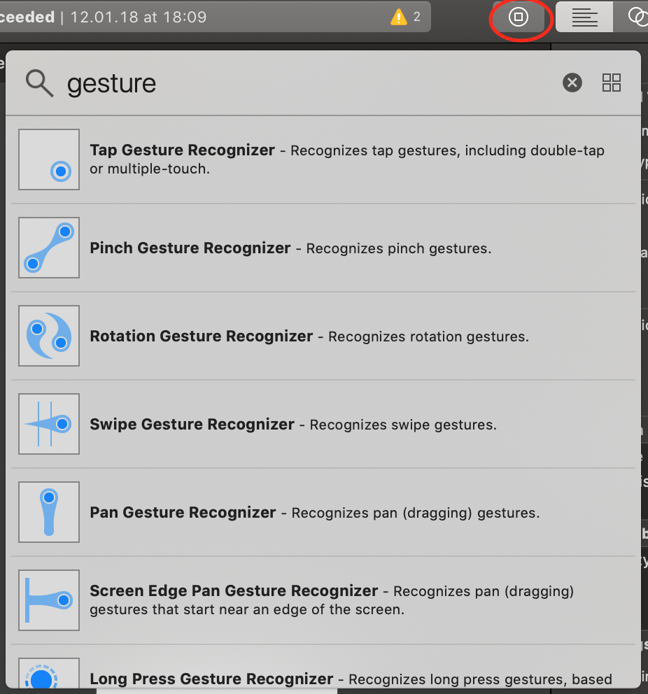
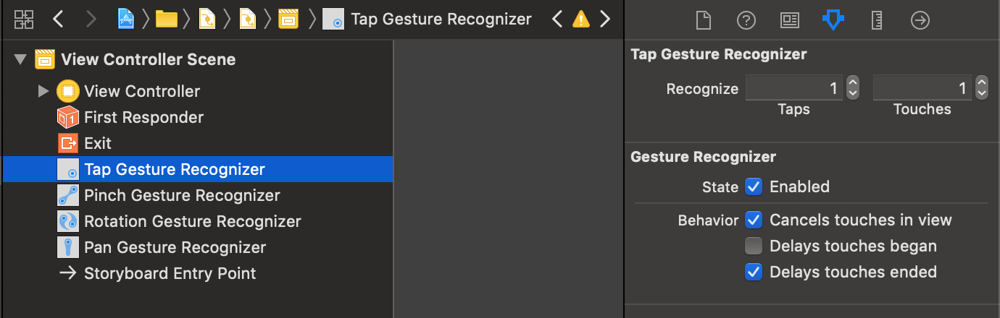
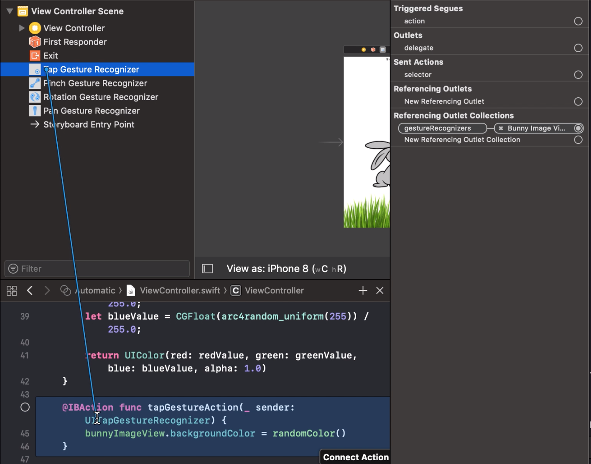
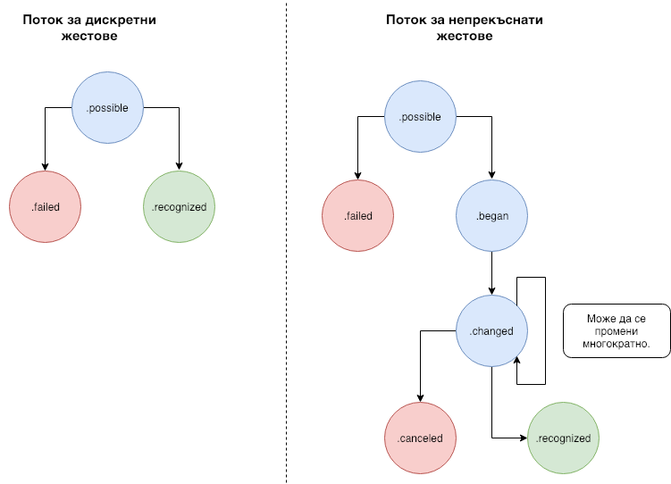

## Guesture Recognizer

Guesture Recognizer-ите са обекти от абстрактният клас UIGestureRecognizer, което значи че за да го използвате трябва да бъде наследен. Този тип обекти са свързани с определено view и наблюдават за предефинирани жестове направени върху това view. Apple ни предоставят няколко предефинирани жестове:

* **UITapGestureRecognizer** - наплюдава за натискане (tap). Може да се следи за това с колко пръста е направен tap-а и/или колко пъти е извършено натискането върху специфицираното view;
* **UILongPressGestureRecognizer** - наблюдава за натискане върху специфицираното view за определен минимиален диапазон от време. В този жест можете да определите също колко пръста ще бъдат необходими за изпълнението на жеста, както минималното време и колко е позволеното отместване;
* **UIPinchGestureRecognizer** - наблюдава за растящо или намаляващо разстояние между двата пръста използвани в този жест;
* **UIRotationGestureRecognizer** - наблюдава за преместването на два пръста в кръг;
* **UISwipeGestureRecognizer** - наблюдава за преместването на подаден брой пръсти в подадена посока;
* **UIPanGestureRecognizer** - наблюдава за преместването на подаден минимален и максимален брой пръсти. Можете да използвате този жест за да направите дори своя имплементация на някой от останалите жестове.
* **UIScreenEdgePanGestureRecognizer** - този жест е наследник на UIPanGestureRecognizer и е подобен на UISwipeGestureRecognizer, но трябва да започва в границите на подаден ръб.

Всички жестове изпълняват действие (action) след като бъде засечен валиден жест. Това може да бъде IBAction, ако жеста бъде добавен от интерфейс билдърa, а също и private или public метод, ако жеста бъде добавен програматично. Когато бъде засечен валиден жест, той изпълнява подаденият аction, като винаги изпраща себе си в случай, че трябва да се вземе допълнителна информация от него, за да се предприемат съответните промени по визуализацията.

### Добавяне на жест програматично

За да добавим жест програматично трябва първо да го създадем, като за създаването са ни нужни цел (target) и действие (action). В този пример ще покажем как се създава tap жест, но останалите типове жестове се създават по сходен начин.

```
let tapGesture = UITapGestureRecognizer(target: self, action: #selector(tapGestureAction(_:)))
```

Следващата стъпка е да настроим нашият жест. За различните жестове настройките могат да бъдат различни, но за tap жеста имаме само две: `numberOfTapsRequired` - колко пъти трябва да бъде натиснато нашето view за да може да бъде отчетен жеста; `numberOfTouchesRequired` - колко пръста трябва да използваме за да бъде отчетен жеста. Ако двете стойности са със стойност 2 ще трябва да натиснем бързо 2 пъти с два пръста.

```
tapGesture.numberOfTapsRequired = 2
tapGesture.numberOfTouchesRequired = 2
```

Също така всеки жест трябва да бъде добавен към view, което ще следи за изпълнението на жеста.

##### Важно:
Ако стойниостта на `isUserInteractionEnabled` параметърът на view, към което добавяме жест, е `false` няма да може да бъде засечен жест.

```
myView.addGestureRecognizer(tapGesture)
```

Действието на жеста просто трябва да приема параметър, който ще приема обектът на жеста *(в случая `UITapGestureRecognizer`)*, но не е задължиетлно, можете да игнорирате параметъра, ако не Ви е нужен.

```
private func tapGestureAction(_ sender: UITapGestureRecognizer) {
    // Блок от код, който ще бъде изпълнен при засичане на жест.
}
```

### Добавяне на жест чрез интерфейс билдъра

Добавянето на жест през интерфейс билдъра става много лесно.

1. Намерете жестът, който искате да добавите, в библиотеката:

* Завлечете го до view-то, към което искате да добавите жеста;
* Можете да настроите жеста през страничното меню:

* Завлечете жеста, като задържате control бутона, до вашияд контролер или до вече създаденият метод в него:


### Използване на няколко жеста едновременно

Тъй като всеки жест може да забави или откаже друг се налага да имплементираме метод от делегата на жестовете за да можем да се справим с няколко жеста работещи едновременно.

Първата стъпка е да направим делегат нашият контролер или view, което отговаря за жестовете и view-тата на жестовете, за всеки от жестовете:

```
pinchGesture.delegate = self
panGesture.delegate = self
```

Следващата стъпка е да имплементираме протокола `UIGestureRecognizerDelegate` в нашият контролер или view и да имплементираме `gestureRecognizer(_:, shouldRecognizeSimultaneouslyWith:)` метода от него.

```
extension ViewController: UIGestureRecognizerDelegate {
    func gestureRecognizer(_ gestureRecognizer: UIGestureRecognizer, shouldRecognizeSimultaneouslyWith otherGestureRecognizer: UIGestureRecognizer) -> Bool {
        return true
    }
}
```

Метода ни предоставя жеста, който иска да започне да се изпълнява, както и другият жест, който му пречи. В случая позволяваме изпълнението на жестовете, които имат за делегат нашият контролер, като връщаме винаги `true`, но можем да добавим други условия, които да бъдат проверявани преди изпълнението на даден жест.

### Персонализиран/Custom жест

В първите версии на iOS не е имало жестове и е трябвало всеки да използва няколко метода за да може да засича серия от жестове. Тези методи все още се използват за да направим наши персонални жестове:

* `touchesBegan(_ touches: Set<UITouch>, with event: UIEvent)` - известява, че е започнато докосване върху екрана (touch);
* `touchesMoved(_ touches: Set<UITouch>, with event: UIEvent)` - известява, че докосването е било преместено по екрана;
* `touchesEnded(_ touches: Set<UITouch>, with event: UIEvent)` - известява, че докосването е приключило;
* `touchesCancelled(_ touches: Set<UITouch>, with event: UIEvent)` - известява, че друго view е спряло докосването.

За да можете да направите свой собствен жест трябва да импортнете следното:

```
import UIKit
import UIKit.UIGestureRecognizerSubclass
```

Вашият жест трябва да е наследник на `UIGestureRecognizer`. Жеста се осъществява при задаване на `.recognized` като стойност на `state` променливата в `UIGestureRecognizer`, но трябва да минете през някои състояния.



Последната стъпка е да `override`-нем `reset()` метода на `UIGestureRecognizer`. `reset()` метода ще се извика, когато приключи опит за разпознаване на жеста. Това е и мястото да занулите вашите променливи.