# Разпространение на iOS приложенията
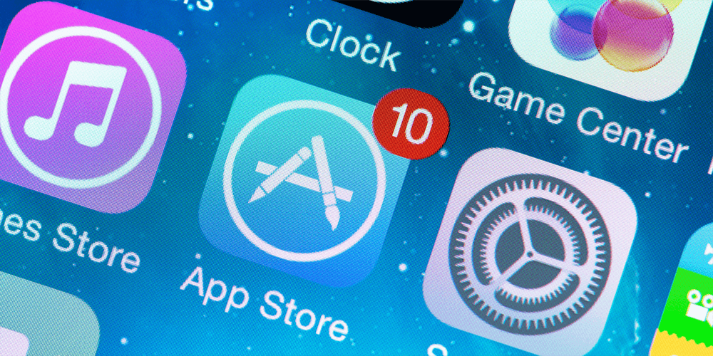

Според Apple **62%** от най-често срещаните откази на приложения възникват поради несъответствие с основните указания на Apple. Но това не трябва да ви плаши. В тази лекция ще разгледаме стъпка-по-стъпка как да разпространим (да качим) нашето приложение.

Необходими са 8 основни стъпки за успешно публикуване на приложението за iOS в App Store:

* Уверете се, че вашето приложение отговаря на основните указанията на Apple за приложенията в App Store (App Store Guidelines)
* Тествайте вашето приложение и се уверете, че то няма дефекти (бъгове - bugs) и сривове (крашове - crashes)
* Регистрирайте като разработчик в системата на Apple
* Създайте запис на вашето приложение в App Store Connect
* Конфигурирайте вашето приложение за разпространение с подходящата информация и данни за него
* Качете версия на вашето приложение в портала
* Изпратете версията за официално ревю
* Пуснете одобрената весрия н Магазина

## Спазване на указанията и изискванията на Apple към приложенията (App Store Guidelines)

App Store на Apple гъмжи от приложения - има повече от 2.2 милиона приложения, които са достъпни до милиони потенциални потребители във всеки един момент.

Въпреки това, преди да достигне едно приложение до App Store, всеки издател трябва да има ясно разбиране за всички изисквания и насоки на Apple, за да направи процеса на качване и разпространение възможно най-плавен. Дори и малко несъответствие може да доведе до отхвърляне на приложението ви.

Една от най-големите причини за отхвърлянето е нежелателно съдържание. Без значение колко готино и функционално е, приложението ви ще бъде отхвърлено, ако съдържа обидно и неподходящо съдържание.

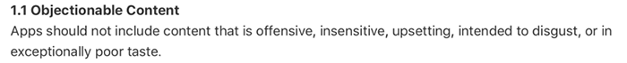

Някои примери за неприемливо съдържание включват:

* Всякакъв вид фанатизъм, расистки, сексистки или хомофобски препратки
* Сексуални или порнографски материали
* Коментари, подбуждащи към религиозна нетърпимост
* Грешна и невярна информация

Други чести причини за отхвърляне на приложения са:

* **Съдържание, генерирано от потребителите**: Тези видове приложения представляват предизвикателства, вариращи от нарушаване на интелектуалната собственост до анонимно малтретиране.
* **Физическа вреда**: Приложението ви не може да се държи по начин, който рискува физически да нарани потребителя.
* **Липса на информация за разработчика**: Apple иска да гарантира, че потребителите, които изтеглят приложението ви, могат да достигнат до вас с въпроси и проблеми с поддръжката.

## Тествайте приложението си, за да се уверите, че няма проблеми с производителността

Един сигурен начин за отхвърляне на приложението е, ако тест открие дефект. Дори да сте блестящи програмисти, вашето приложение Ще има бъгове с различна сериозност.

Цялостното тестване ще ви помогне да определите, че функционалността е стабилна и следва спецификациите. Не се откриват сривове и дефекти.

В допълнение, има редица iOS устройства - iPhone, iPad и iPod, и всички идват в различни размери. Колкото повече устройства тествате с приложението си, толкова по-добри са шансовете ви за одобрение от App Store. Трябва да се уверите, че вашето приложение се вписва добре на всички размери на екрана, което е трудно да се направи на някои iOS симулатори.

И дори ако екипът за преглед на App Store не открие никакви грешки, това не означава, че потребителите ще са доволни от всичко. Не забравяйте да тествате и поведението на приложението си (UX - user experience), тъй като отрицателното мнение на потребителите може да доведе до неуспех на приложението ви.

## Станете член на програмата за разработчици на Apple
За да качите приложението си в App Store, трябва да се регистрирате за програмата за разработчици на Apple. Програмата ви позволява да използвате допълнителни инструменти на Apple, да виждате анализи на използването на приложението, извършвайте бета тестване и др.

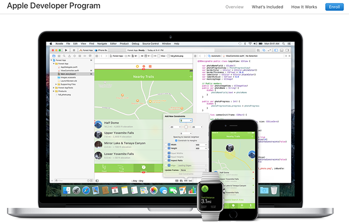

Регистрацията в програмата на Apple не е безплатна и плащането е на основавата на годишен абонамент. Частни лица или юридически лица с един служител могат да се запишат за $99 на година. Ако имате екип, членството ще ви струва $299 на година. Членството в екип ви позволява да използвате един акаунт.

Програмата предлага достъп до най-съвременните технологии на Apple, които могат да ви помогнат да създадете полезни и привлекателни приложения.

Например, можете да интегрирате Apple Pay в приложението си, да активирате приложението си за съхраняване на данни от приложения в iCloud или да интегрирате социални възможности в игри Game Center.

## App Store Connect акаунта ви позволява най-доброто управление на приложенията

App Store Connect портала е набор он уеб-базирани инструменти, с които менажирате приложенията си, които предлагате на пазара iPhone, iPad, Mac, Apple Watch, Apple TV и дори iMessage. Като член на Програмата за разработчици на Apple, вие качвате, управлявате и разпространявате приложенията си.

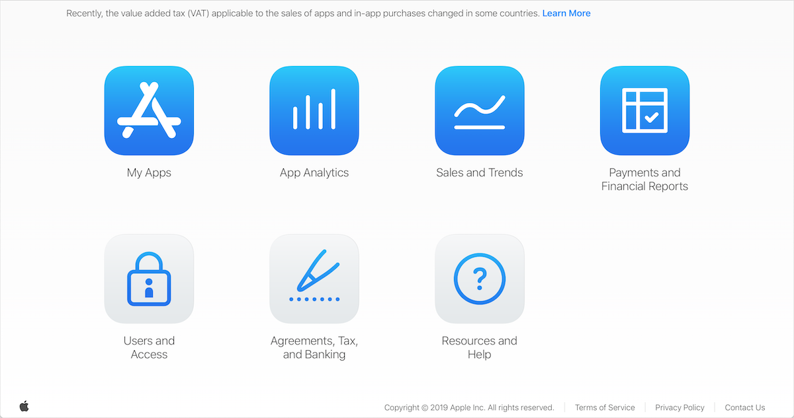

## Конфигуриране на приложението ви за разпространение
Преди да можете да публикувате приложението, трябва да предоставите информация, за да завършите процеса. Тази информация включва:

* Иконка на приложението
* Снимки и визуализации
* Метаданни

Трябва да предоставите икона на App Store, която се използва за представяне на приложението ви в различни секции на App Store. Невъзможно е да получите одобрение за приложението си без икона и вие или вашият дизайнер трябва да създадете привлекателна икона за приложението си. Apple предоставя набор от указания, които могат да ви помогнат да коригирате правилно иконата си.

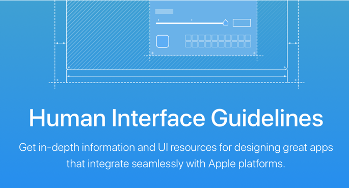

Трябва да използвате снимки и визуализации на приложението, за да предадете възможно най-много от предимствата на приложението си. Визуализациите могат да бъдат изображения или кратък видеоклип, заснет от приложението ви, който ще се показва на страницата на продукта в App Store.

Добрe е да се създадат поне 5 скрийншота на приложението и поне едно видео за предварителен преглед. Ако приложението ви работи на няколко устройства, трябва да предоставите на потребителите си снимки за всяко устройство. Вашите снимки могат директно да повлияят на окончателното решение на потребителя дали да изтеглите приложението ви или не.

Приложението ви трябва да има подробно описание с всички необходими метаданни. Метаданните трябва да включват следното:

* Името на приложението ви
* Номера на версия
* Категория, в която попада приложението ви
* Подробно описание
* Други допълнители ключови фрази

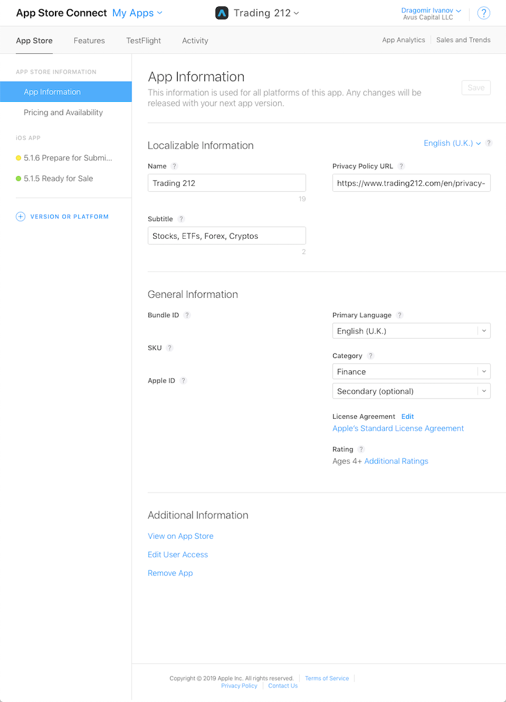

Една потенциална опасност за отхвърляне на приложението ви, представлява описанието. Някои от вас може да гледат на описанието като на място за маркетинг, но това може да отлъчи потенциални потребители, както и да не се хареса на ревюиращите.

Всичко, което се сметне за подвеждащо, двусмислено или неискрено, ще доведе до отхвърляне на приложението. Apple не желае потребителите да се чувстват измамени или да се разочароват, когато изтеглят приложение. Бъдете честни и нека вашата упорита работа говори сама за себе си.

Последната стъпка е да архивирате приложението си. Архивът ви позволява да компилирате приложението си и да го съхранявате заедно с критична информация за отстраняване на дефекти в един пакет, управляван от платформата за качване. Преди да качите приложение в App Store Connect, стартирайте стандартните проверки за проверка архива (Validate), за да определите дали отговаря на минималните изисквания на App Store и се уверете, че те минават.

## Качване на приложението ви

### 1. Подписване на кода: Създайте профил за дистрибуция на iOS приложение и сертификат за разпространение (distribution provisioning profile / distribution certificate)

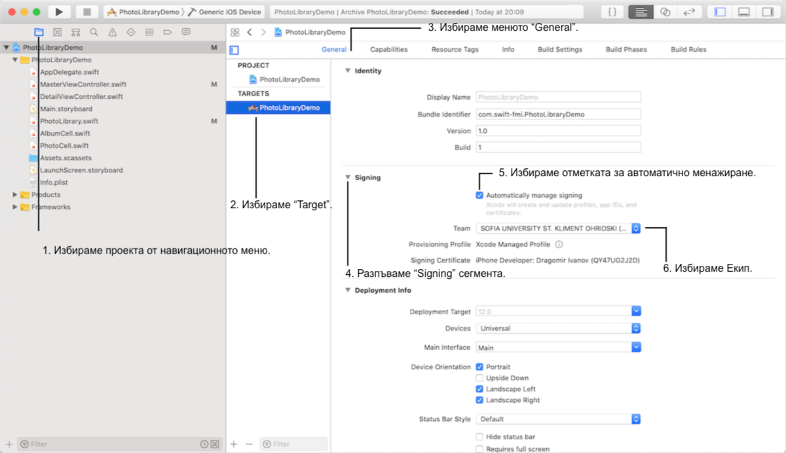

### 2. Създайте запис в App Store Connect за приложението си (част от предната стъпка)
Трябва да създадете запис в портала, преди да можете да качите приложението си за разпространение чрез App Store. Този запис включва цялата информация, необходима за управление на приложението и която се показва в App Store.

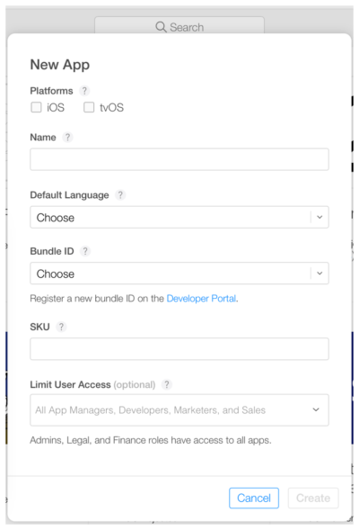

### 3. Архивирайте и качете приложението си чрез Xcode
* В Xcode изберете "Generic iOS Device" като желано утстройсво.
* Изберете „Product“ от горното меню и кликнете върху „Archive“.
* Организаторът на Xcode ще стартира, показвайки всички архиви, които сте създали някога.
* Уверете се, че е избрана текущата компилация и кликнете върху „Качване в App Store“ в дясното меню.
* Изберете вашите идентификационни данни и кликнете върху „Choose“.
* В следващия прозорец, който се появява, кликнете върху „Upload“ в долния десен ъгъл.

Съобщението за успешно качване ще се появи, когато качването завърши. Кликнете върху „Done“.

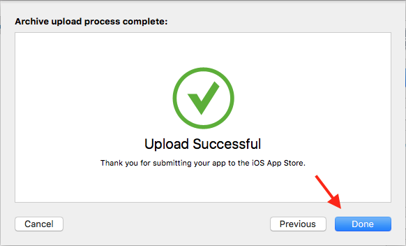

Състоянието на приложението в портала би трябвало да е „Prepare for submission“. Избирането на приложението на тази страница ще ви позволи да преглеждате и редактирате информация за приложението.

Преди да пуснете приложението си в App Store, можете да използвате TestFlight на Apple, за да разпространявате бета версията (или актуализациите на приложения) на тестерите, които ще осигурят ценна обратна връзка.

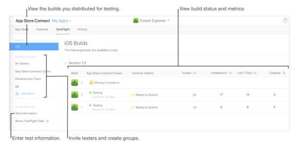

## Пускане на приложението за ревю
Всяко приложение, което е предадено към магазина, трябва да бъде прегледано от екипа на Apple преди пускането му. Приложението трябва да отговаря на всички посочени указания, за да бъде одобрено.

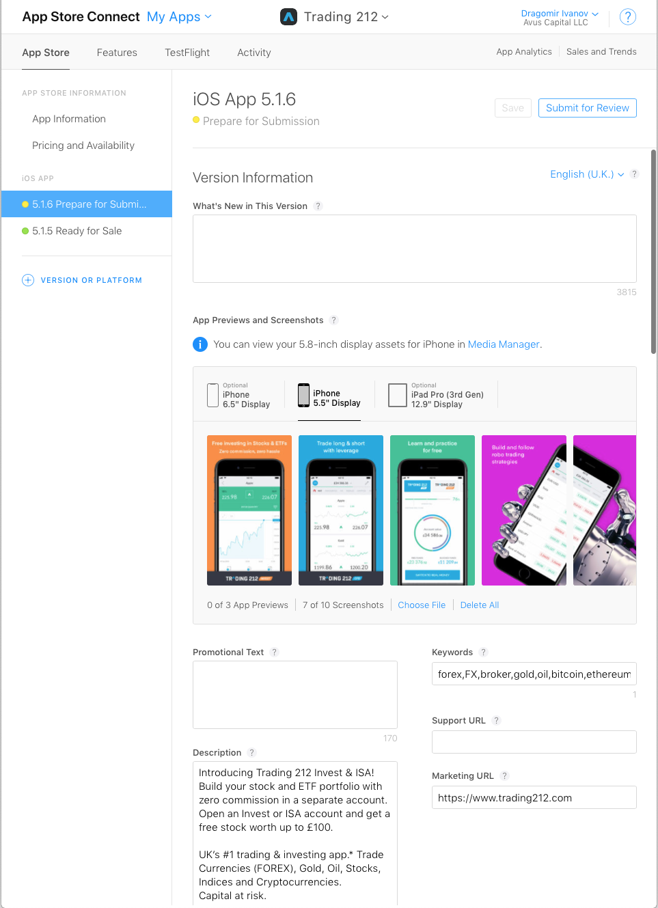

След първоначалната проверка, състоянието на приложението ще е променено на Изчакване за преглед (Waiting for Review). Прегледът на приложения може да отнеме от 1 до 3 дни. Добрият процес на предварително преглеждане преди пускане за ревю, увеличава вероятността приложението ви да бъде одобрено.

Ако обаче рецензентът отхвърли приложението ви, можете да общувате с Apple и да разрешавате проблеми в центъра за резолюция (Resolution Center). Съобщение от Apple съдържа важна информация за причините за отхвърлянето на приложението ви, например ако приложението не отговаря на указанията за преглед на App Store.

Можете да се кореспондирате с Apple чрез Центъра за резолюция, докато не придвижите отново версията за ревю. Можете да включите прикачени файлове в отговорите си, включително снимки на екрани от приложението ви и нужни документи. Ако приложението ви е било отхвърлено поради проблем с метаданни, можете да разрешите проблема и да подадете отново същата компилирана версия, без да се налага да правите нов архив.

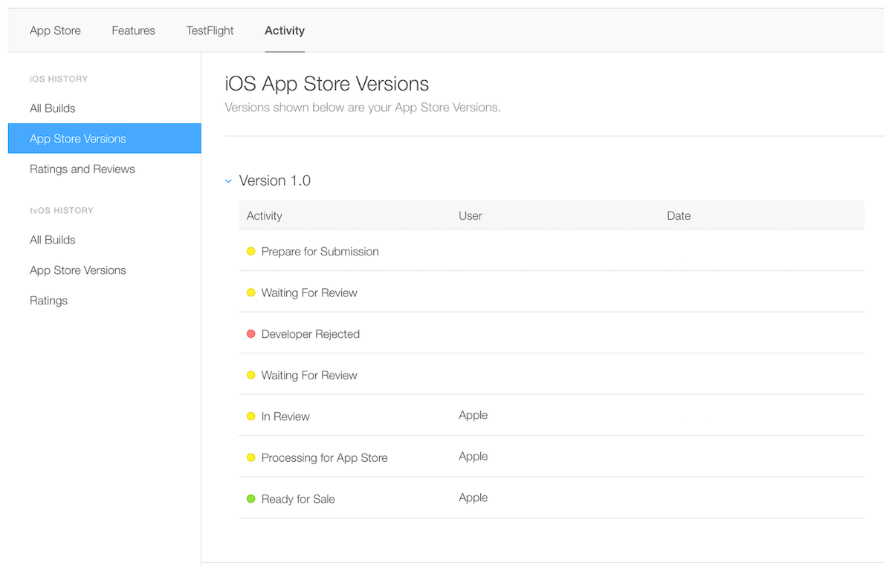

## Пускане на приложението
След като приложението ви бъде прегледано и одобрено, можете да заявите ръчно или автоматично пускане на одобреното приложение.

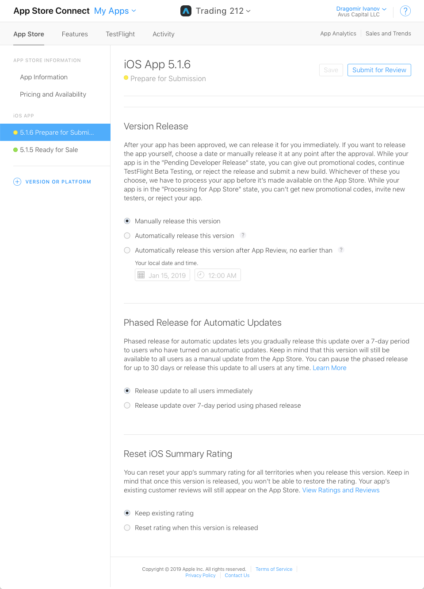

Автоматичното пускане обикновено е поетапно, изпращайки вашето iOS приложение постепенно към потребителите. Тази опция е налична, ако изпращате актуализация на версия за iOS и приложението ви е в едно от следните състояния:

* "Prepare for Submission"
* "Waiting for Review"
* "In Review"
* "Waiting for Export Compliance"
* "Pending Developer Release"
* "Developer Rejected"
* "Rejected"
* "Metadata Rejected"

Ако изберете тази опция, актуализацията на версията ще бъде пусната за период от 7 дни до процент от вашите потребители (избрани на случаен принцип от Apple ID) на iOS устройства с включени автоматични актуализации. Потребителите не са уведомени, че са в поетапно пускане на приложението ви.

Ако изберете за ръчно пускане, можете да кликнете върху "Release your app", когато сте готови да разпространите приложението до потенциалните си потребители. При пускане може да отнеме от 1 час до 1 ден преди приложението да се появи в App Store.

## След успешно пускане на приложението ви
Вече сте в App Store! Можете да преглеждате изтегляния, продажби, оценки и прегледи директно в App Store Connect.

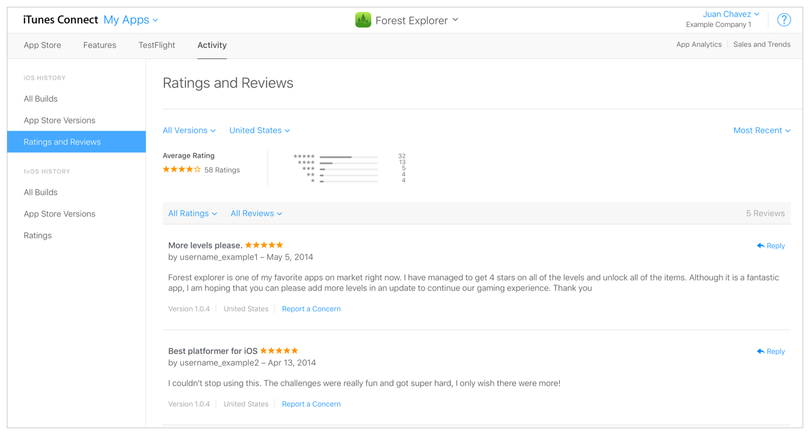