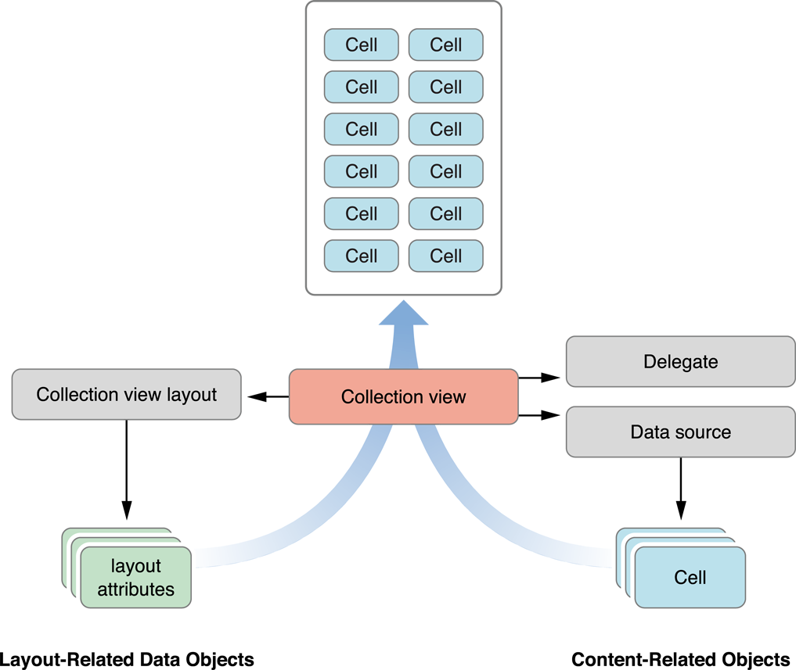

#Table VIew

UITableView или по друг начин казано таблиците в iOS се използват за визуализиране на вертикално (хоризонтално) съдържание,съставено от набор отделни клетки. Обикновено таблиците се използват, когато съдържанието е по-голямо и не може да се визуализира изцяло в рамките на самия екран. Но могат да бъдат полезни дори при малко съдържание защото предоставят значителна гъвкавост и динамичност.
Много важно да се отбележи е че тези клетки могат да се преизползват от системата и в практиката за почти всяка таблица това се явява задължително.

#Елементи

* Редове - Отделните редове или така наречените клетки на таблиците.

* Секции - Изпозваме ги да разделим логически клетки от различни типове.

* Headers - Използват се като заглавни пояснения над секциите

* Footers - Използват се за пояснения под секциите

* [Delegate][1] - Таблиците имат референция към [обект][3],който да управлява селекцията,конфигурира пояснителните клетки под и над секциите (section header и section footer),помага за изтриването и пренареждането на клетките и други.

Този [обект][3] се нарича делегат(delegate) и трябва да имплементира UITableViewDelegate протокола.

		protocol UITableViewDelegate  

* [Datasource][2] - Таблиците имат референция към [обект][4], който да управлява данните от модела, които ще се визуализират в таблицата. Datasource обекта предоставя на таблицата информацията, която е необходима за да конструира и модифицира данните в интерфейса.
Протокола съдържа задължителни и опционални методи. Когато един обект е регистриран, че имплементира даден протокол,той трябва задължително да имплементира базовите методи.
Те предоставят на таблицата клетките, които трябва да визуализира и също така броя секции и редове за секция.

Този [обект][4] трябва да имплементира UITableViewDataSource протокола.
		
		protocol UITableViewDataSource

Някои основни методи на delegate и dataSource обектите:
 
    @available(iOS 2.0, *)
    optional public func tableView(_ tableView: UITableView, heightForRowAt indexPath: IndexPath) -> CGFloat

    @available(iOS 2.0, *)
    optional public func tableView(_ tableView: UITableView, heightForHeaderInSection section: Int) -> CGFloat

    @available(iOS 7.0, *)
    optional public func tableView(_ tableView: UITableView, estimatedHeightForRowAt indexPath: IndexPath) -> CGFloat

    @available(iOS 7.0, *)
    optional public func tableView(_ tableView: UITableView, estimatedHeightForHeaderInSection section: Int) -> CGFloat

    @available(iOS 2.0, *)
    optional public func tableView(_ tableView: UITableView, viewForHeaderInSection section: Int) -> UIView?

    @available(iOS 2.0, *)
    optional public func tableView(_ tableView: UITableView, didSelectRowAt indexPath: IndexPath)

    @available(iOS 2.0, *)
    optional public func tableView(_ tableView: UITableView, editingStyleForRowAt indexPath: IndexPath) -> UITableViewCell.EditingStylе
    
* [NSIndexPath][5] - UIKit добавя допълнителен интерфейс към класа, за да може да се използва за идентифициране на редовете и секциите на визуалните таблици и колекции в iOS.Обекти от класа също могат да се създават през методите на UITableView и UICollectionView. Swift използва [IndexPath][7] структурата,която замества напълно NSIndexPath класа от Foundation библиотеката. 

#Свойства

* rowHeight - Височина на клетките
* sectionFooterHeight - височина на разделителните клетки за сецкиите 
* sectionHeaderHeight -
* separatorColor - цвят на разделителя
* tableHeaderView - Основно view над таблицата
* tableFooterView - Основно view под таблицата

####Setup

1. Добавяне на таблица в интерфейса
2. Добавяне на delegate и dataSource на таблицата
3. Имплементиране на необходимите методи на delegate и dataSource.
4. Определяне на различните типове клетки, големини на клетките,секции и др.
4. Подсигуряване на данни за таблицата,които да се визуализират в нея.
5. Презареждане на таблицата при промени в данните.

####Update

Когато има промяна в данните на таблицата,нейната визуализация също трябва да  бъде променена. Има няколко начина и подхода за това.
Най-генерално на UITableView обект може да се извика метода reloadData.
Този метод изцяло презарежда таблицата като преконфигурира всичките й визуални елементи наново.
Делегата има други методи, чрез които се изпълняват визуалните промени в таблиците,като при тях не е необходимо да се презарежда цялата информация и промяната може да бъде анимирана.

####Customize

Средата ни предоставя нялко различни типа клетки, които са предефинирани и готови за директно използване. Техните елементи могат да се популират с различни данни, но промяната на типа,броя и визуализацията на тези клетки е  силно ограничена в сравнение със създаването на собствени такива.
Това става посредством наследяването на [UITableViewCell][6].

#Collection View

Управлява и представя подредена колекция от елементи.
Когато добавите UICollectionView към приложението си, основната ви отговорност е да обработвате и предоставята данните,които ще се визуализират от UICollectionView обекта.
Подобно на UITableView за това се грижи [dataSource][12] обекта,който добавите към колекцията си. Съответно този обект трябва да имплементира [UICollectioViewDataSource][10] протокола. 

		protocol UICollectioViewDataSource

Подобно на клетките при таблиците, при колекциите имаме единичен елемент(item),които могат да бъдат групирани в отделни секции.
За презентиране на отделните елементи в колекциите се използва [UICollectionViewCell][13] обекта.Можем да използваме както системните,така и наши собствени имплементации на обекта.
Също като при таблиците и при колекциите имаме допълнително визуални елементи,които да предоставят или визуализират различна информация за клетките в отделните секции или колекции като цяло.
Тези допълнителни елементи се упвляват от [UIColletionViewLayout][8] обекта.
Отново за добавянето,изтриването и пренареждането на клетките се грижи dataSouce обекта на колекцията,а за избраните елементи се грижи [delegate][11] обекта на колекцията,който имплементира [UIColletionViewDelegate][9] протокола.

		protocol UIColletionViewDelegate
		
UICollectionViewLayout обекта е отговорен за организацията и позицията на всички клетки и допълнителни view-та на колекцията.

#Елементи

####Основен компонент - [UICollectionView][14]
Основния елемент,в който ще се визуализира цялото съдържание подобно на UITableView. Също като UITableView,UICollectionView наследява UIScrollView.

####Клетки - [UICollectionViewCell][13]
Подобно на UITableViewCell в таблиците. Тези клетки изграждат и визуализират основното съдържание в колекцията.Също като при таблиците,клетките на една колекция могат да бъдат създавани в кода или през Interface Builder.

####View-та за допълнителна информация - Supplementary Views 
Използват се за допълнителна информация към секциите на колекцията.

####[Delegate][11] 

* [UIColletionViewDelegate][9] 

####[Datasource][12]

* [UICollectioViewDataSource][10] 

####Setup

1. Добавете UICollectioView към view йерархията нa приложението.
2. Изберете класа, който да бъде delegate и dataSource и отбележете,че имплементира UICollectionViewDataSource и UICollectionViewDelegate.
3. Добавете този клас като delegate и dataSource на колекцията.
4. Добавете инстанция на UICollectionView към желания View Controller.
5. Ако искате да използвате различни от системните клетки създайте нов клас,който наследява UICollectionViewCell.
6. Ако стройте layout-та си в Interface Builder,добавете на клетката си новия клас,който създадохте и идентификатор за преизползване.
7. Добавете view елементи към клетката в зависимост от съдържанието и дизайна.
8. Добавете референции към view елементите на клетката в класа,който създадохте за нея.
9. Определете модела,който ще се използва за популирането на колекцията.
10. При необходимост добавете API за зареждане на данни в модела.
11. При необходимост добавете DataSource клас,който да се грижи за заявките и да съхранява получените от тях данни.
12. Имплементирайте необходимите методи от UICollectionViewDelegate и UICollectionViewDataSource протоколите.
13. Заредете данните в класа,който имплементира двата протокола.
14. Нагласете визуалното разположение на елементите на колекцията.
15. Презаредете данните.

####Update

* Data update - reloadData()
* Layout update - invalidateLayout()

####Customize

* Custom cells

##Референции и полезни връзки

* [Tables Human Interface Guidelines][20]
* [Collections Human Interface Guidelines][21] 

[1]: https://developer.apple.com/documentation/uikit/uitableviewdelegate
[2]: https://developer.apple.com/documentation/uikit/uitableviewdatasource
[3]: https://developer.apple.com/documentation/uikit/uitableview/1614894-delegate
[4]: https://developer.apple.com/documentation/uikit/uitableview/1614955-datasource
[5]: https://developer.apple.com/documentation/foundation/nsindexpath
[6]: https://developer.apple.com/documentation/uikit/uitableviewcell
[7]: https://developer.apple.com/documentation/foundation/indexpath
[8]: https://developer.apple.com/documentation/uikit/uicollectionviewlayout
[9]:  https://developer.apple.com/documentation/uikit/uicollectionviewdelegate
[10]:https://developer.apple.com/documentation/uikit/uicollectionviewdatasource
[11]: https://developer.apple.com/documentation/uikit/uicollectionview/1618033-delegate
[12]: https://developer.apple.com/documentation/uikit/uicollectionview/1618091-datasource
[13]: https://developer.apple.com/documentation/uikit/uicollectionviewcell
[14]: https://developer.apple.com/documentation/uikit/uicollectionview

[20]: https://developer.apple.com/design/human-interface-guidelines/ios/views/tables/
[21]: https://developer.apple.com/design/human-interface-guidelines/ios/views/collections/
