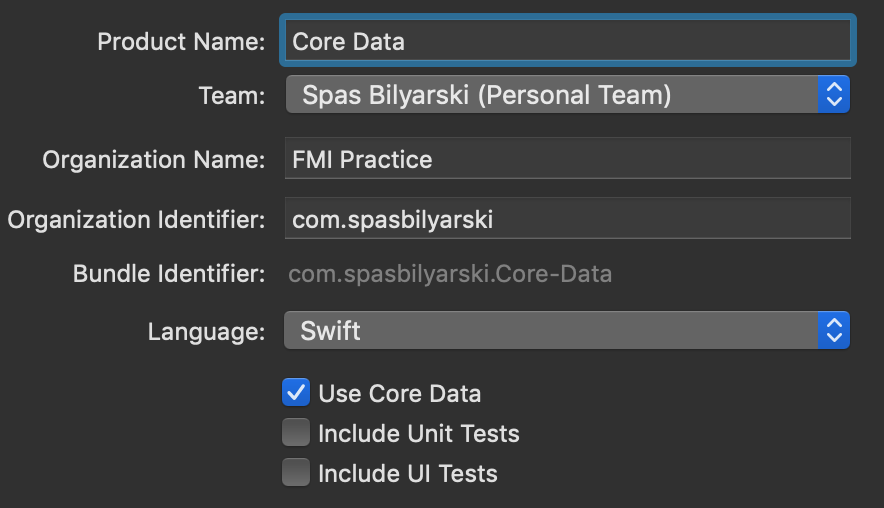
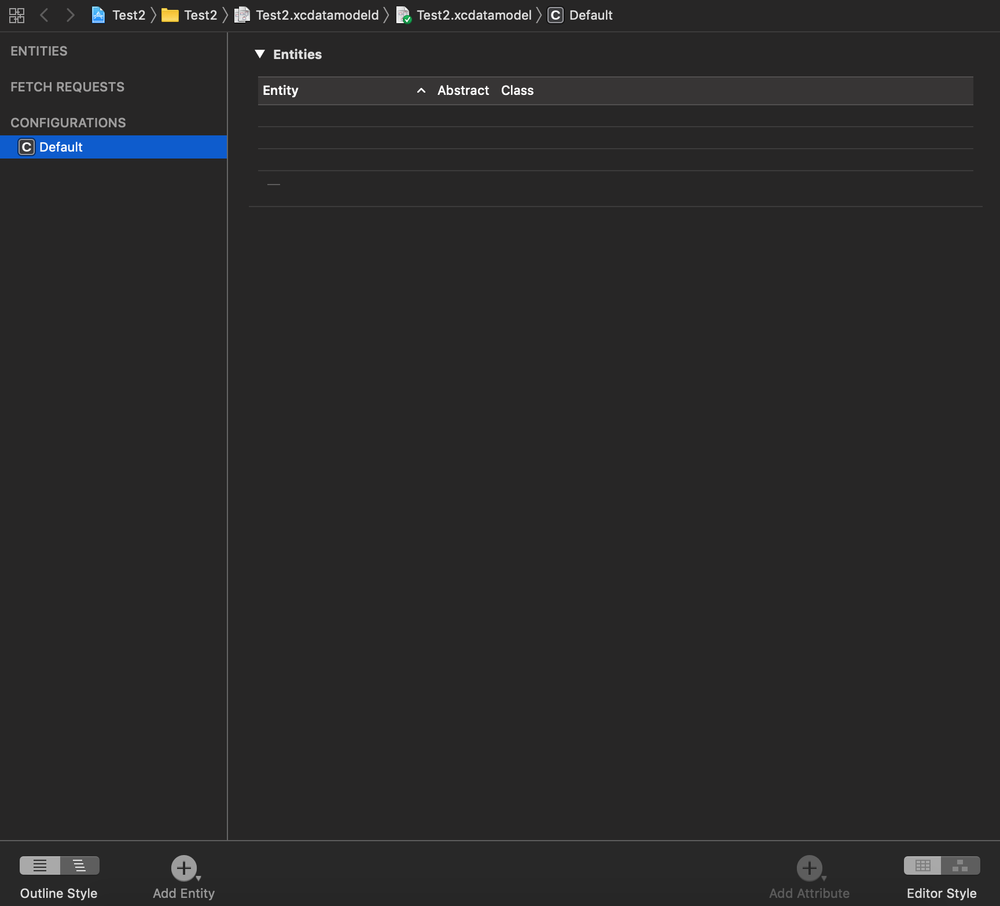
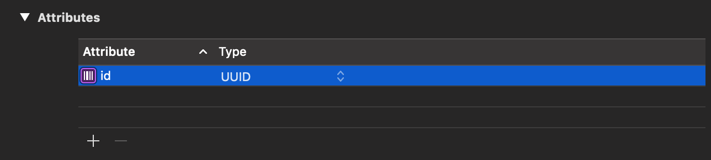
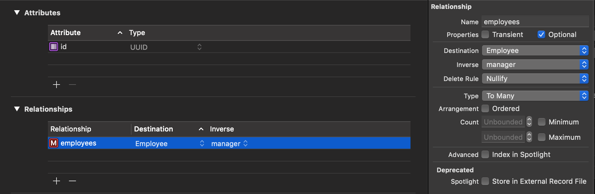
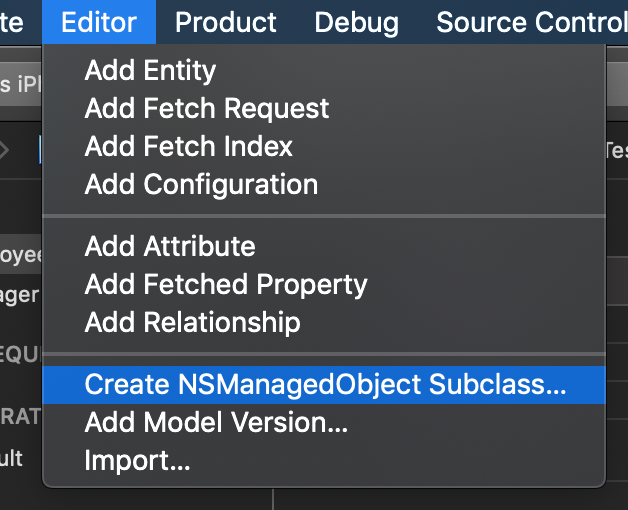
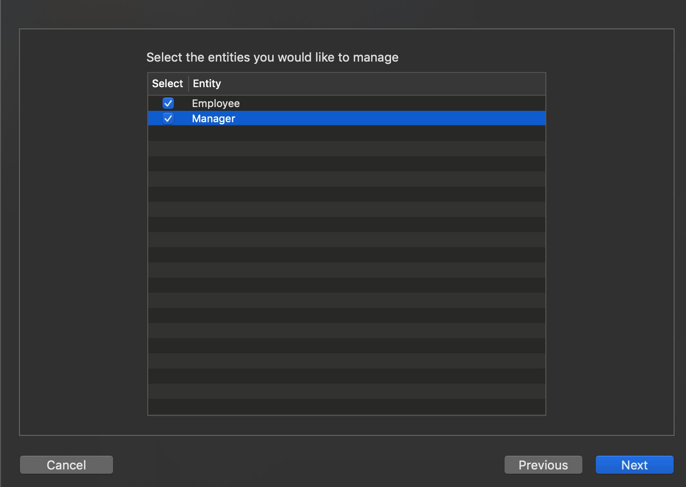
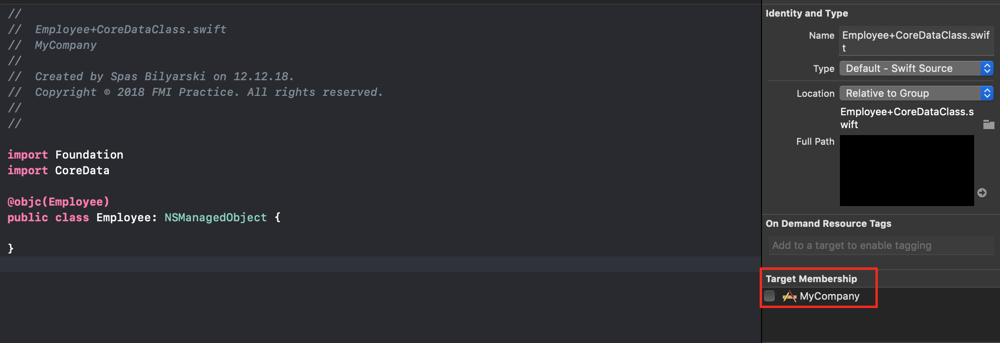

# Core Data

Core Data е един от най-използваните framework-ци в iOS приложенията. Той се използва за управление на обекти в model вариант. Можете да го използвате за да запазвате, променяте и филтрирате данните във Вашето приложение, но Core Data не е база данни. Core Data използва SQLite, тъй като съхранява данните пернаментно, но самият framework не е база данни. Core Data може много повече от базите данни като управлението на обектите във визуален интерфейс, проследяване на промените в данните и много други.

### Добавяне на Core Data в нашият проект

Можете да добавите Core Data още при създаването на вашето приложение, като добавите отметката `Use Core Data`:


Промените, които ще настъпят при създаването на проекта във вашият AppDelegate, са няколко и можете да ги добавите ръчно, ако имате вече съществуващ проект:

* Ще импортне Core Data: `import CoreData`;
* Ще създаде променливата `persistentContainer`:

```
 lazy var persistentContainer: NSPersistentContainer = {
        let container = NSPersistentContainer(name: "Test2")
        container.loadPersistentStores(completionHandler: { (storeDescription, error) in
            if let error = error as NSError? {
                fatalError("Unresolved error \(error), \(error.userInfo)")
            }
        })
        return container
    }()
```

NSPersistentContainer опростява създаването и управлението на Core Data стека, като обработва създаването на модела `NSManagedObjectModel`, координатора `NSPersistentStoreCoordinator` и `NSManagedObjectContext`.

##### Важно:
Трябва да замените кодa използващ `fatalError()` за да прихващате грешки, които могат да настъпят при запазване. `fatalError()` кара приложението да генерира crash лог и да спре приложението. Не трябва да използвате тази функция в приложение за крайни потребители, но може да е доста полезно по време на разработка.

Чести грешки при създаването на координатора:

	- Няма достатъчно пространство на устройството;
	- Базата не може да бъде обновена към новата версия на моделите;
	- Базата не може да бъде достъпена заради настройки или защита на данните, например когато устройството е заключено.

* Ще добави функция за запазване на промените настъпили по време на живота на приложението:

```
    func saveContext() {
        let context = persistentContainer.viewContext
        if context.hasChanges {
            do {
                try context.save()
            } catch {
                let nserror = error as NSError
                fatalError("Unresolved error \(nserror), \(nserror.userInfo)")
            }
        }
    }
```

* Ще извика функцията `saveContext()` при изключване на приложението:

```
    func applicationWillTerminate(_ application: UIApplication) {
        saveContext()
    }
```

* Ще създаде файл `{Името на приложението}.xcdatamodeld`, от където можете да създавате и управлявате обектите в базата.

### Управление на данните

В проекта вече трябва да имате файл с разширение `.xcdatamodeld`, от него можете да достъпите доста мощен едитор за модел данни.



Както виждате терминологията в Core Data е малко по-различна от тази в повечето бази данни, с които сте се сблъсквали до момента. Нека минем през основните термини, с които ще работите:

* `entity` - това е клас дефиниран в Core Data, в релационните бази наричаме същият обект - таблица и представлява вашите модели за данни. В класическите примери използваме `entity` за "Служител" или "Компания";
* `attribute` - това е късче информация от Вашият модел (`entity `). В релационната база го наричаме поле от таблицата. Например, ако имаме модел "Служител" в него ще имаме атрибути (`attribute`): име, позиция, заплата и така нататък;
* `relationship` - това е връзка между няколко модела (`entity`). В Core Data връзките са два вида: към един `to-one relationships` и към много `to-many relationships`. Например, ако имаме модел "Мениджър" можем да имаме връзка от тип към много с модела "Служител", като пък модела "Служител" ще има връзка от тип към един с мениджърът си.

В долният ляв ъгъл ще видите бутон `Add Entity`, чрез него можете да създавате Вашите модели за данни. Това ще създаде нов модел с име `Entity` или последвано от някакъв номер, ако вече имате модел със същото име. Можете да го преименувате по всяко време като просто го изберете и натиснете enter.

За да добавите нов атрибут изберете вашият модел, което ще покаже таблица съдържаща всичките му атрибути и връзки към други модели, в края на секцията `Attributes` ще видите малък + бутон. Когато го добавите трябва да го именувате и да зададете типът от данни, които ще съдържа.



За да добавите връзка процесът е подобен. Натиснете малкият + бутон в края на секцията `Relationships`. Трябва да смените името на връзката, да добавите дестинация, моделът към който сочи връзката и можете да изберете връзката, която сочи обратно към текущият модел. Можете да смените типа на връзката от страничното меню към `To Many` или `То Оне`.



### Генериране на данни

Едно от най-полезните приимущества на Core Data е, че не ни се налага да пишем ръчно клас за всеки модел, който добавим в едитора. Дори генерирането става с няколко клика:

* Изберете `Editor` > `Create NSManagedObject Subclasses ...`:



* Опцията ще Ви поиска да изберете кои модели искате да генерира или обнови:



* И последно ще поиска да посочите къде да запази моделите.

С вече създадените модели ще можете спокойно да работите с вашите модели и атрибути във Вашето приложение.

##### Важно:
По подразбиране новите файлове създадени за моделите се добавят към вашият таргет. Това обаче не е желателно, тъй като ще Ви спре да компилирате проекта. Затова отворете всеки файл генериран от моделите и махнете отметката на `Target membership`.



### Запазване в Core Data
### Вземане на данни и филтриране/търсене
### Изтриване на данни в Core Data


