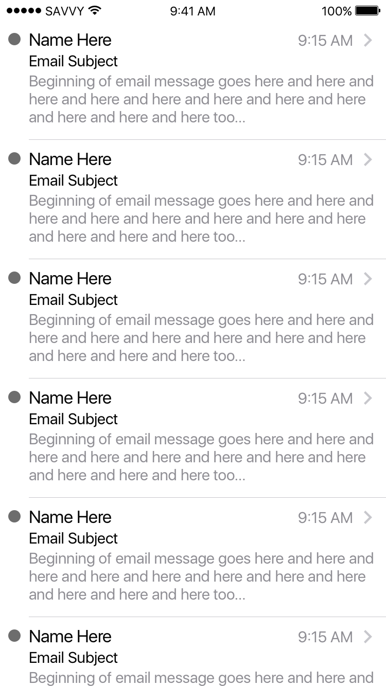

## Писмено изпитване

## Задача 1:

Направете проект проект, който имитира списъка от съобщения в Mail клиента на iOS. Той е изработен така, че да съдържа тестови данни в модел, но няма никаква презентация. 

Вашата задача е да постигнете нещо близко до следния изглед използвайки `UICollectionView` или `UITableView`. При натискане на съответната клетка да се отваря нов ViewController, в който да се изписва цялото съдържание на емайл-а.

