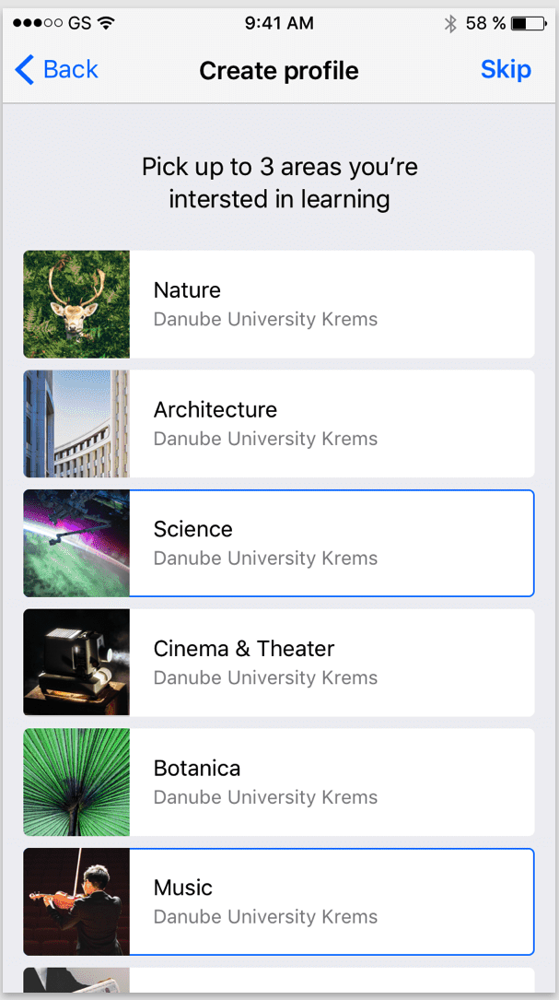
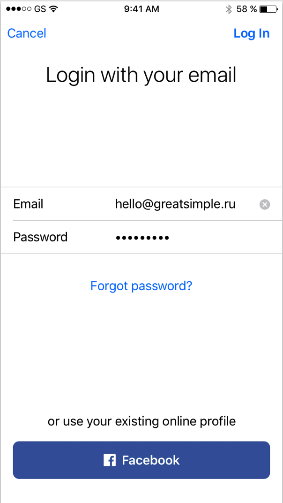
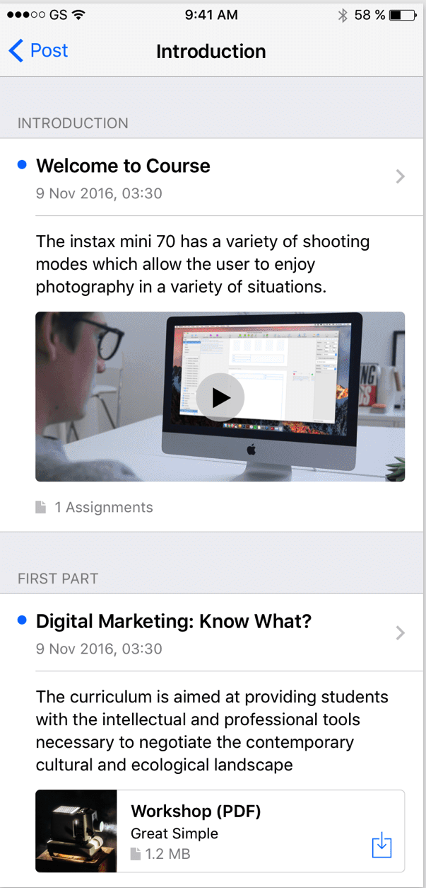
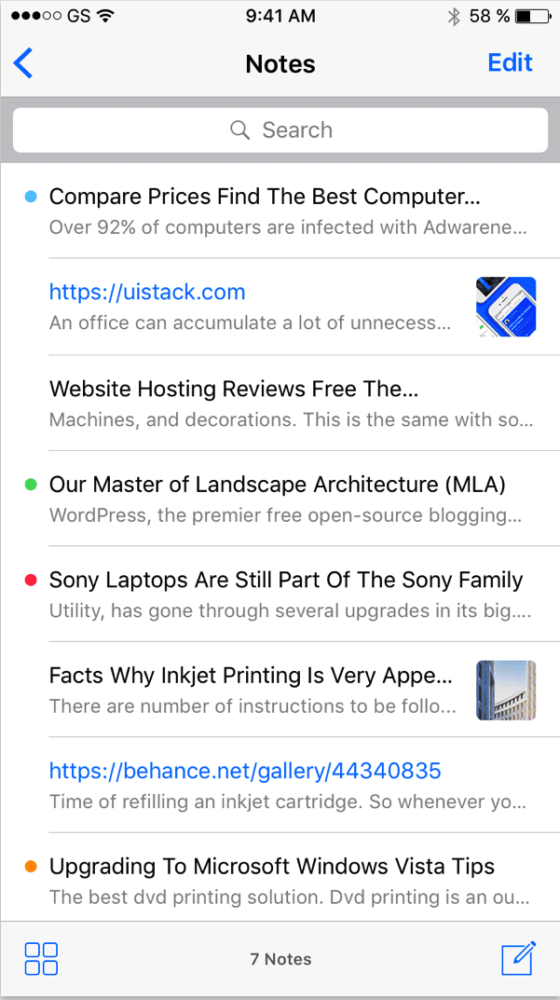

# FMI app

Приложение, което ще предоставя достъп до курсовете и техните лекции водени във ФМИ. Студентите ще могат да достъпват лекциите и другите материали свързани с курсовете.

Началния екран, позволява разглеждането на курсовете по типове.

В приложението могат да влизат само регистрирани потребители или да се регистрират нови. 

След избор на тип курсове се представят всички курсове, които са асоциирани със съответния тип.

При избор на курс, се представя списък с лекциите му.

Да се добави възможност за търсене на информация в заглавието на лекцииите или краткото им описание (локално на устройството).

При избор на лекция, можем да видим повече информация за самата лекция:

* кой ще я води
* продължителността й. 
* кога последно е променена
* текста на лекцията (html версия)
* връзка към видео (при активиране се отваря видеото в пълен екран)


## Допълнителна информация

1. Регистрацията на потребители да се реализира с Firebase
2. Да се реализира списъка от лекциите с видео, ако такова има добавено към лекцията. Ако няма видео, тогава изгледа съдържа само текст.

# API 

Приложението трябва да консумира следните json данни, които ще получава на следния адрес:

`server/api/sections`

Примерен резултат:

```json
{
    "sections":[
        {
            "id": 1,
            "name": "Информатика",
            "image": "cs_image.jpg"
        },
        {
            "id": 2,
            "name": "Математика",
            "image": "cs_image.jpg"
        }
    ]
}
```


`server/api/courses/?section={sectionId}`

Примерен резултат:

```json
{
    "courses":[
        {
            "id": 1,
            "name": "Програмиране със Swift",
            "image": "cs_image.jpg"
            "startDate": "20190220"
        },
        {
            "id": 2,
            "name": "Програмиране за iOS със Swift",
            "image": "cs_image.jpg"
        }
    ]
}
```

`server/api/course/{courseId}/`

Примерен резултат: `server/api/course/1/`

```json
{
    "lectures":[
        {
            "id": 1,
            "name": "История на Swift",
            "image": null,
            "video": null,
            "summary" : "Тази лекция разглежда историята на Swift",
            "date" : "20190220"
        },
        {
            "id": 2,
            "name": "Променливи",
            "image": null,
            "video": null,
            "summary": "В тази лекция ще разгледаме променливи и константи.",
            "date" : "20190220"
        }
    ]
}
```

`server/api/lecture/{courseId}/`

Примерен резултат: `server/api/course/1/`

```json
{
    "id": 1,
    "name": "История на Swift",
    "lecturer": 
    {
        "name": "Емил Атнасов",
        "position": "лектор",
        "photo": "avatar.jpg"
    },
    "video": null,
    "updated" : "20180505",
    "details": "{escaped-html}"
        
}
```

# Въпроси

1. Ще има ли реален сървър, който да предоставя реална инфромация в `json` формат? - Екипът подготвя реална имплементация. Към момента може да разчитате, че формата на данните ще е като предоставения.