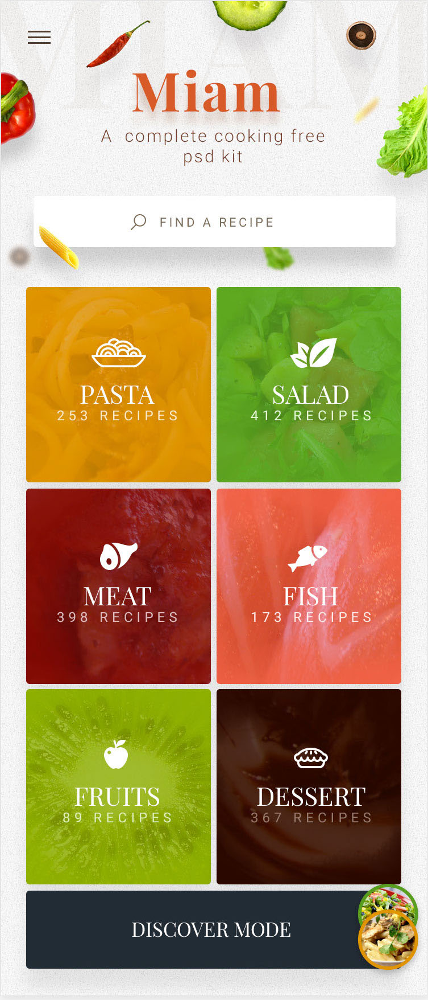
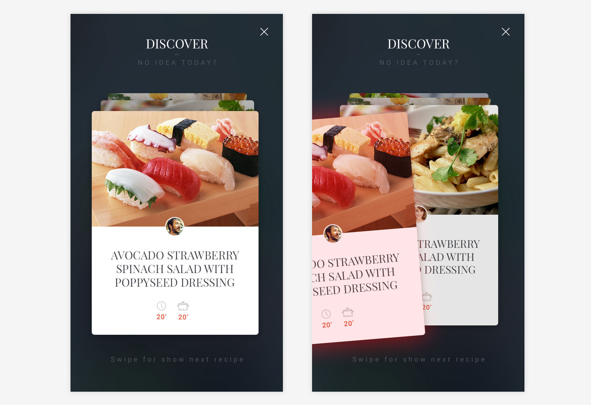
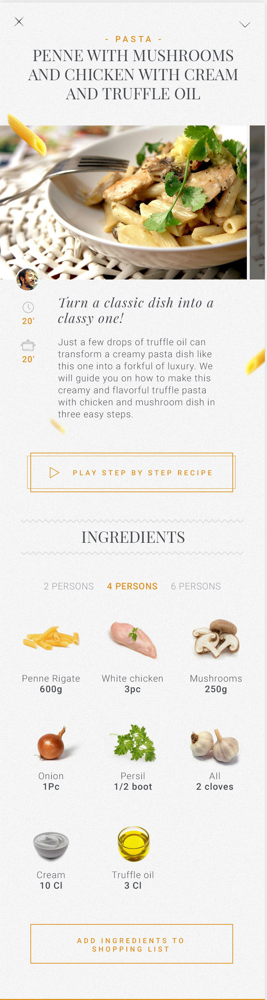
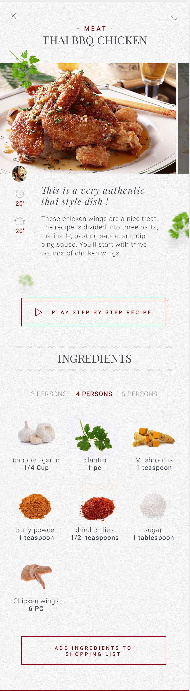
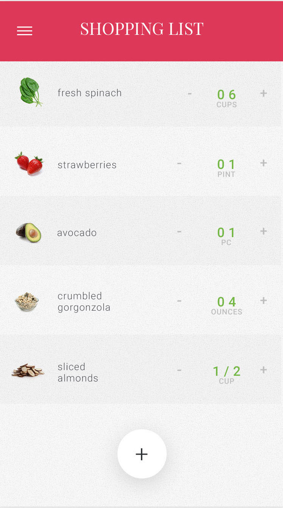

# Рецепти

Мобилно приложение, което улеснява всекидневния избор на рецепти за готвене и позволява по лесен, бърз и забавен начин да се търсят нови рецепти. С приложенито може да се създават авторски рецепти като последователност от стъпки, описани с текст, снимки и видео.

## Лесен начин за избиране на рецепта
Рецептите са разделени по групи. Всяка група съдържа различен брой рецепти. Има и специален режим за разглеждане на рецептите като карти. 

### Примерен екран за разглеждане на рецепта
Информацията за рецепта трябва да представлява списък от картинки, добавени при създаването на рецепта, заглавие, текст и съставките, които са необходими. Следват примерни екрани.

## Създаване на рецепта
Създаването става в няколко стъпки с възможност за редактиране. Приложението предоставя възможност за лесен и бърз избор на съставки под формата на картинки.След завършването на последната стъпка става публикуването на рецептата. 
Да може да се добавят картинки [или видео към рецептата - бонус].
>Забележка: Няма примерни екрани.

## Списък с покупки
Да може да се вземат всички съставки от дадена рецепта и да се добавят към списък с покупки. Списъка с покупки да позволява добавянето и премахването на елемент.

# Допълнителна информация
Следват допълнителни условия, които дават разяснение по имплементацията на приложението.
>Забележка: Няма примерни екрани.

1. Да се базира на `Firebase`.
2. Да се използва Tabbar със следните пет опции:
    - изследвай (различни секции и после карти)
    - фаворити (списък на отбелязаните рецепти)
    - създай рецепта (виж описание)
    - списък за покупки (виж екрана)
    - за приложението (един екран с информация за приложението, изпозлваните библиотеки и екипът, който го разработва)
3. Създай рецепта - Да се реализира като последователност от екрани, които позволяват въвеждането на текст, време за приготвяне, добавянето на снимки/а и въвеждането на всички съставки за 4 порции.
4. Изследвай - може да се използва следната библиотека [Koloda](https://github.com/Yalantis/Koloda) или [VerticalCardSwiper](https://github.com/JoniVR/VerticalCardSwiper)

# Често задавани въпроси

1. Защо трябва да ползваме `Firebase`? - `Firebase` позволява изграждането на сървърна част от клиента. Т.е. не е нужно да имаме предварително изграден сървър. Можем да изградим подходщи модели и записвайки данни от клиентите (мобилнито приложение), те се съхраняват в споделена база от данни. Другите клиенти могат да достъпват вече съхранените данни.
2. Трябва ли да може да работи приложението без интернет? - Не е задължително, но е препоръчително да се разгледа предоставената възможност от `Firebase`.
3. Трябва ли да се придържаме стриктно към предоставените екрани? - Добре е да се отличава един стил в приложенито и то да изглежда хомогенно. Не е нужно да е едно към едно с предоставените дизайно, но е задължително да се придържате към общия стил.
4. Какъв модел трябва да позлвам? - Това ще трябва да бъде решено от отбора и може да бъде дискутиран по време на упражнения с преподавателския екип. Възможни са и промени в последствие, за да се постигне желания резултат - функциониращо приложение.